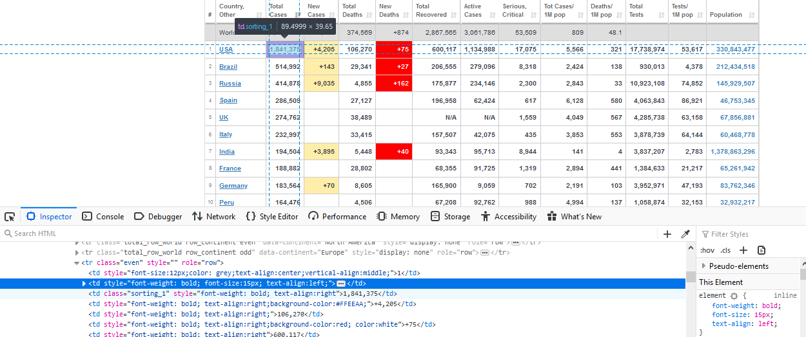

# Corona scrap and store

## About

This is a part of the data scraping project on Corona virus news and stats worlwide. Project goal was to collect data daily about Corona Virus cases and informations from different sources ( mostly websites / newspapers) in order to show its impact on economy, stock markets, unemployment (labour services), prices of oil, food price index etc.

In this small application/script, data is scraped, collected, filtered and stored in local database. After that program will tell the user (Text-to-Speech) daily update in new cases worldwide. This part of application is written in Python and 4 libraries.

### Libraries:
* BeautifulSoup
* requests
* pymysql
* win32com 

If you combine this with some job scheduler software like Windows Task Scheduler or cron at Linux you almost got a bot.
To get most accurate data you should run the script around 2:00AM at (UTC+01.00) time zone.
**corona.sql** file is product of all this work. Data should be pretty accurate for European countries because script was usually ran between (22.00pm and 01:30am). But data for North and South America, Asia, and Australia will be incomplete, because different timezones. To get most out of this program you should run the program around 2:15am at UTC +1(Belgrade, Bratislava, Budapest). 
New cases for the next day start counting from around 3AM every day.

 **This was built with no intension to sell or redistribute collected data.**

## File overview

File | Explanation
------------ | -------------
baza.py | Database processing logic
tables.py | Scraping logic
format.py | Filter data (data)
numbtoword.py | Convert number to word
talkthetalk.py | Speak daily update in cases
start.py | main function

## 

**baza.py** - The class MySqlCommand involves database operations, there are six functions:
  * **get_connection()**
  * **close_connection()**
  * **insert_date(self,new_cases,new_deaths)** - populate table `date`
  * **select_max()** - get max_id from table `date`
  * **insert_row(self,max_id(date table),args)** - populate table `statistics` with current row (some country daily data)
  * **update_last()** - for a short period of time, there was the row "first case" so i updated the db with that row.
  
**tables.py** - file consist N functions:
  * **get_table()** - creates a BeautifulSoup object, search through the tree and then returns a table that consist data
  * **get_new_data()** - returns a tuple with new cases and deaths (worldwide) that is extracted from table( get_table() )
  * **count_rows()** - returns number of rows in the scraped table
  * **scrap_table()** - this function scrap table, extract data from every row, and returns a 2D array.
  * **beautiful_table()** - this function filter 2D array (because data repetition)
 
**format.py**
  * **format_row(max,array_data)** - function takes array of data as an argument (that represent one row of scraped table) and then filter the data (delete/replace commas, +, -, N/A, whitespaces). Function returns a new array with clean data suitable and ready for storing into database.
 
 **talkthetalk.py**
   * **you_tell(new_cases,new_deaths):** - Function responsible of telling the user daily update in new cases. (Uses win32com library, that interact with the Microsoft Speech SDK to speak daily update).
   
   
# Screenshots

Inspecting the DOM...

Result of **beautiful_table()** function:

